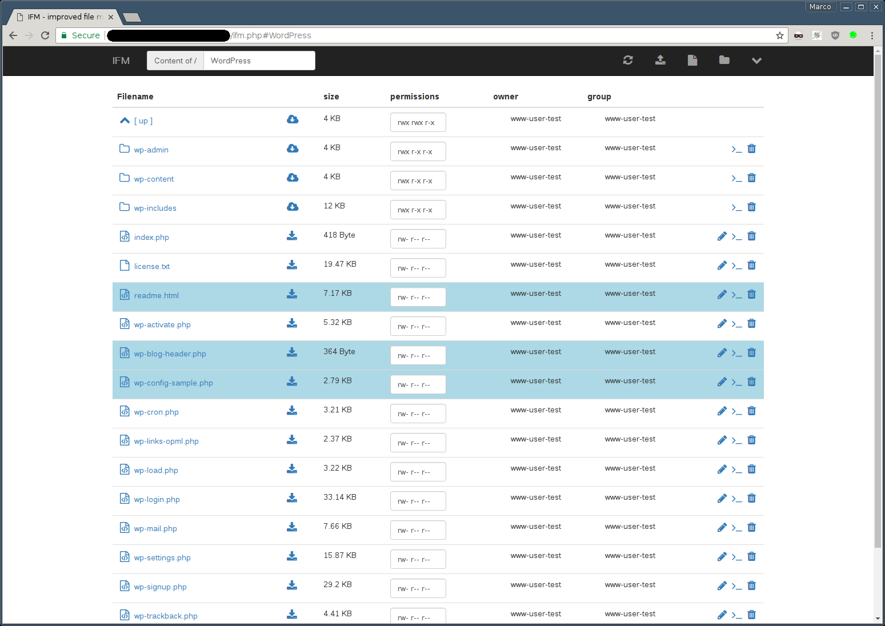

<!--
N.B.: This README was automatically generated by https://github.com/YunoHost/apps/tree/master/tools/README-generator
It shall NOT be edited by hand.
-->

# IFM for YunoHost

[](https://dash.yunohost.org/appci/app/ifm)    
[](https://install-app.yunohost.org/?app=ifm)

*[Lire ce readme en français.](./README_fr.md)*

> *This package allows you to install IFM quickly and simply on a YunoHost server.
If you don't have YunoHost, please consult [the guide](https://yunohost.org/#/install) to learn how to install it.*

## Overview

### features

- create/edit files and directories
- copy/move files and directories
- download files and directories
- upload files directly, remotely via URL or per drag & drop
- extract archives (tar, tgz, tar.gz, tar.bz2, zip)
- change permissions
- image preview
- simple authentication (LDAP via ldap_bind possible)


**Shipped version:** 2.6.3~ynh1

**Demo:** https://ifmdemo.gitea.de/

## Screenshots



## Disclaimers / important information

The IFM is usually locked to it's own directory, so you are not able to go above. You can change that by setting the root_dir in the scripts [configuration](https://github.com/misterunknown/ifm/wiki/Configuration).
## Documentation and resources

* Official app website: https://github.com/misterunknown/ifm
* Upstream app code repository: https://github.com/misterunknown/ifm
* YunoHost documentation for this app: https://yunohost.org/app_ifm
* Report a bug: https://github.com/YunoHost-Apps/ifm_ynh/issues

## Developer info

Please send your pull request to the [testing branch](https://github.com/YunoHost-Apps/ifm_ynh/tree/testing).

To try the testing branch, please proceed like that.
```
sudo yunohost app install https://github.com/YunoHost-Apps/ifm_ynh/tree/testing --debug
or
sudo yunohost app upgrade ifm -u https://github.com/YunoHost-Apps/ifm_ynh/tree/testing --debug
```

**More info regarding app packaging:** https://yunohost.org/packaging_apps